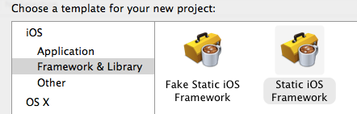

# 如何构建一个iOS的Framework

## 准备工作

1. 下载模板 `git clone git@github.com:kstenerud/iOS-Universal-Framework.git`

2. 安装模板 （直接运行目录**Real Framework**下的`install.sh`）

3. 重启Xcode

4. 新建项目时，在**Framework & Library**中可如果看到**Cocoa Touch Framework**就说明已经安装成功了。

传送门: [模板官网](https://github.com/kstenerud/iOS-Universal-Framework) 

## 开始创建Framework

1. 选择**Cocoa Touch Framework**，创建一个项目工程
*  往工程项目中添加类文件，配置Framework头文件
*  修改Framework支持的最低版本 （默认为Xcode支持的最高版本）
*  打开**Build Phases**，展开**Headers**，将**Project**中的头文件拖入**Public**
*  运行`Command + B`
*  编译完成，打开Product，右击Framework文件选择**Show In Finder**，就可以找到生成的Framework文件

## 如何将Framework嵌入项目

## Contact

**author:** Andy Jin  
**Email:** andy_ios@163.com

##Licenses

All source code is licensed under the [MIT License](https://github.com/andy0323/Framework-practice/blob/master/LICENSE).